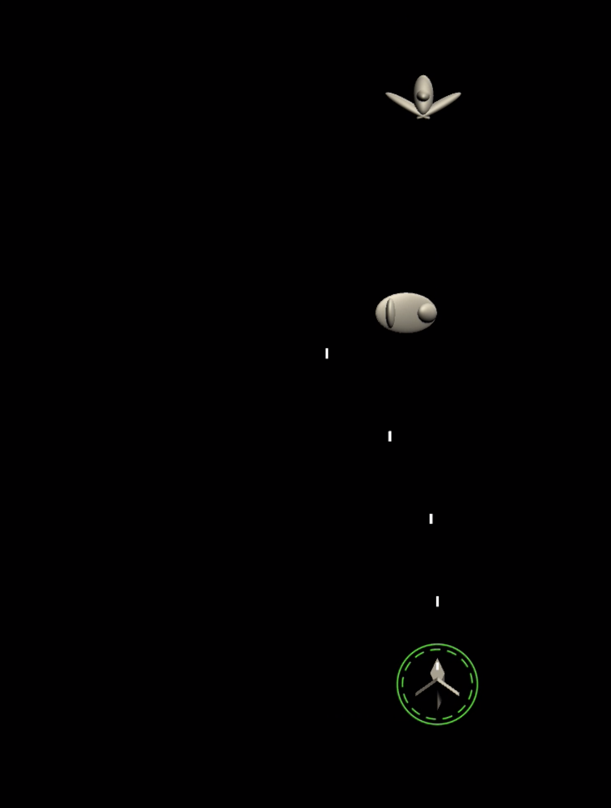

## Grammi’s Quilts

As a child, I used to be mesmerized by the flower quilts my Grammi would create. Upon inspection, I started to notice patterns in her designs. A single quilt would contain around 40 squares, and each square would be made up of rotated triangles to form the flower petals. Although the quilts looked complex in their entirety, they were quite simple to create when broken up into smaller pieces.

## The Savior For Developers

Similar to following a quilting pattern, designing a web application or a game can also rely on basic patterns to make a complex development process much simpler. In software engineering, design patterns do not offer a specific solution, but rather provide a general template that can be implemented in a variety of different ways. Although they aren’t language specific and don’t provide a complete copy-able method, they provide proven long-term solutions to common problems that programmers run into during the development process.

## Using Patterns for Game Development

It wasn’t until the professor of my game development class started to discuss the multiple design patterns we would be using over the semester that I realized I’d been unknowingly using them for years. One of the recent projects I worked on was a version of the galaxy shooter arcade game, [Galaxian](https://www.arcadeclassics.net/80s-game-videos/galaxian). In the game, two popular design patterns were used. The first was a singleton, which was used as an instance for the hero (user-controlled object). The user’s player needed a singleton, or global instance of the object, because it interacted with all of the other elements in the game. The other design pattern that was implemented in the game was the observer. This design pattern was used as an event handler to check whether the hero’s bullets had collided with an enemy spaceship. Using these two design patterns helped me to understand how to develop a game that required the interaction and dependence of multiple objects in a more efficient way than if I had started from scratch. Rather than using a trial-and-error method, I was able to think about the design process before beginning development and finish the game much faster. Overall, having adequate knowledge of design patterns allows developers to focus on the finer details of a program without having to worry about unforeseen bugs due to poor implementation.

