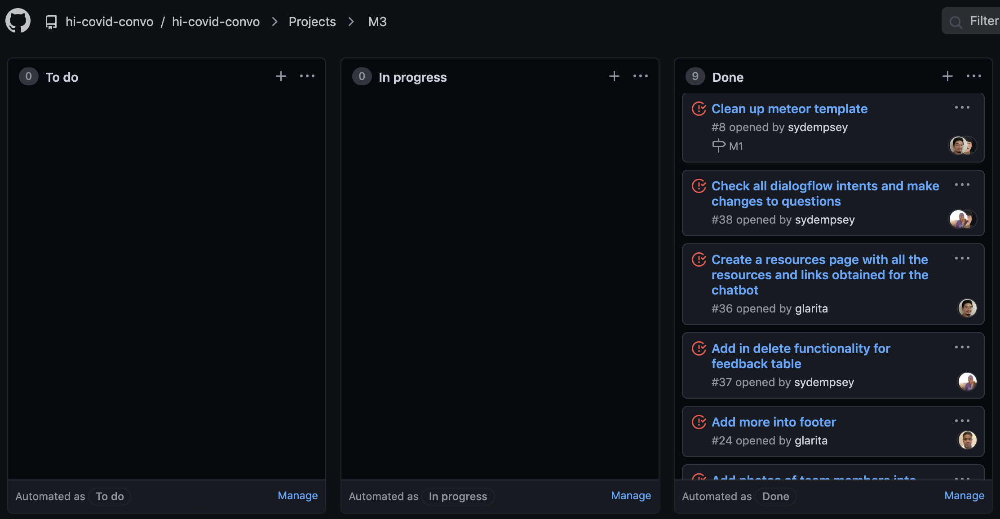

## Choosing Lifelong Learning 
I began my first software engineering class with mixed feelings; eager to gain more insight into the career path I decided on, but also nervous about my lack of experience. I was worried that there was too much to learn and too little time. Yet, the very thing I was afraid of is what now motivates me as a career in software engineering is reliant on constantly learning. I now understand that success in this field is dependent on correctly applying many of the concepts that were covered in ICS 314.

## Efficient Project Management

When working with a team, it can become difficult to keep track of everyone’s progress and manage what still needs to be worked on. The unorganization can lead to confusion and usually ends with the team scrambling to meet the deadline. Over the past semester, I was introduced to Issue Driven Project Management. This approach breaks down large projects into smaller issues and makes the entire development process more easily manageable. For the final project, breaking up the work into issues allowed my team to visualize all of our tasks, and keep track of our progress. Assigning tasks via a project board allowed my team to hold each other accountable and ensure that features we planned to implement were not lost between the cracks. The project board significantly simplified the organization of the project and set up our team to work efficiently. Moving forward, I will definitely implement Issue Driven Management for team projects. This is one of the best methods I have come across for all team members to visually see the progress of a project and keep track of current, completed, and future tasks. 

## Merging with Confidence
At the beginning of the year, I was in a team of seven for a web-application project. One of the biggest challenges we faced in the project was overwriting work that a team member had completed. This problem stemmed from none of us understanding how to apply a Configuration Management technique. Configuration Management is used to develop a stable and consistent system. In the class, we were consistently exposed to a Configuration Management technique through the use of git and GitHub: source control. Becoming more familiar with GitHub made completing projects and collaborating within a team much more efficient. We were able to implement features in parallel without worrying about breaking the entire project or overwriting a team member’s code. GitHub is a commonly used source control platform in the workforce, and after completing the class, I can say that I am now confident in using it for future projects. 

## As One Door Closes
Upon hearing the term software engineering, my first impression was that it sounded like a complex field. As my first software engineering class draws to a close, I can safely say that my initial conclusion was accurate. Due to the ever changing applications of technology, it is impossible to become an expert after pursuing a career in this field. However, it is possible to master fundamental development concepts that can be applied to a multitude of projects. I’m nowhere near an expert of these concepts after completing the course, but I am grateful to have been introduced to them. The class encompassed many valuable techniques that I am excited to apply in future projects. 

