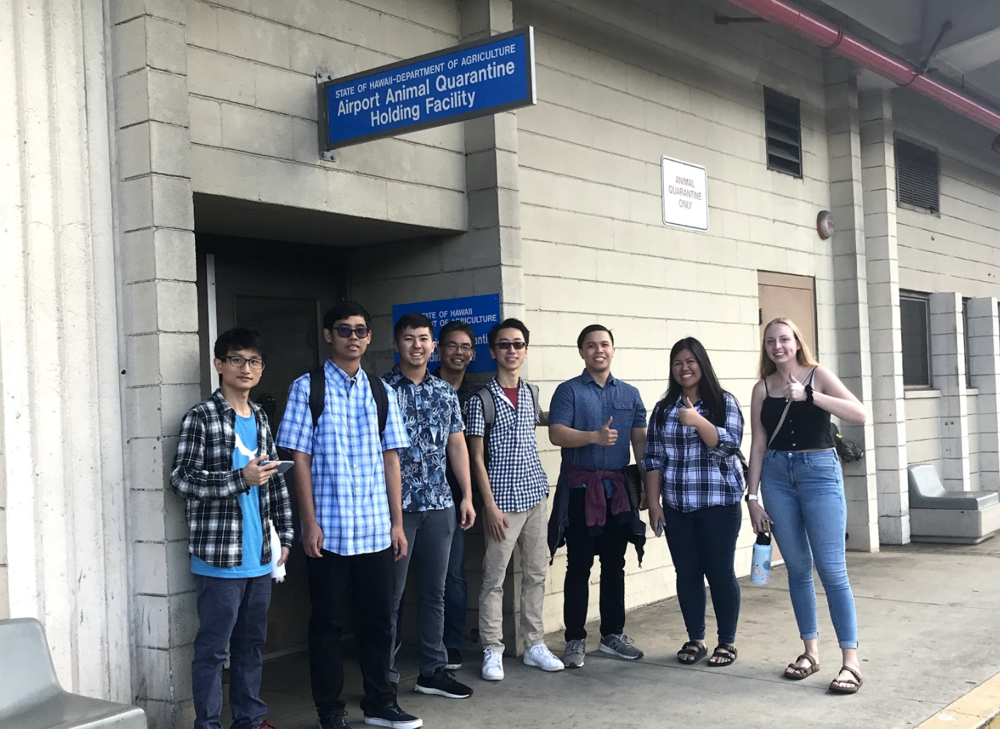

In the Spring 2020 semester, I worked alongside six other computer engineering students to develop a queuing solution for the Animal Quarantine Facility at the Daniel K. Inouye International Airport. Our team was mentored by industry professionals from [DataHouse](https://www.datahouse.com/).

From the project, we were able to see the planning and execution of the design process after meeting with the client and learning about the problems they were facing. We viewed the process of picking up a pet from the facility from all perspectives, and thought about possible solutions that would alleviate many of the staff’s problems before deciding on a final design. 

To develop a check-in and queueing system, we used Angular CLI for the front-end, and SQL for the back-end. This project was my first time developing a web application and it was exciting to provide a solution that would be used on a daily basis. Not only did I learn both soft and technical skills, but I also confirmed that software is what I want to pursue after graduation. 
