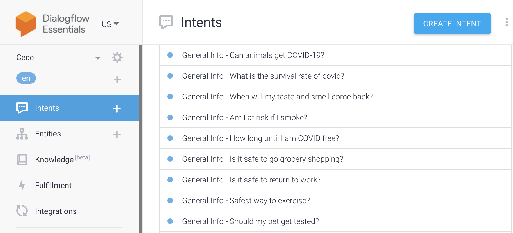
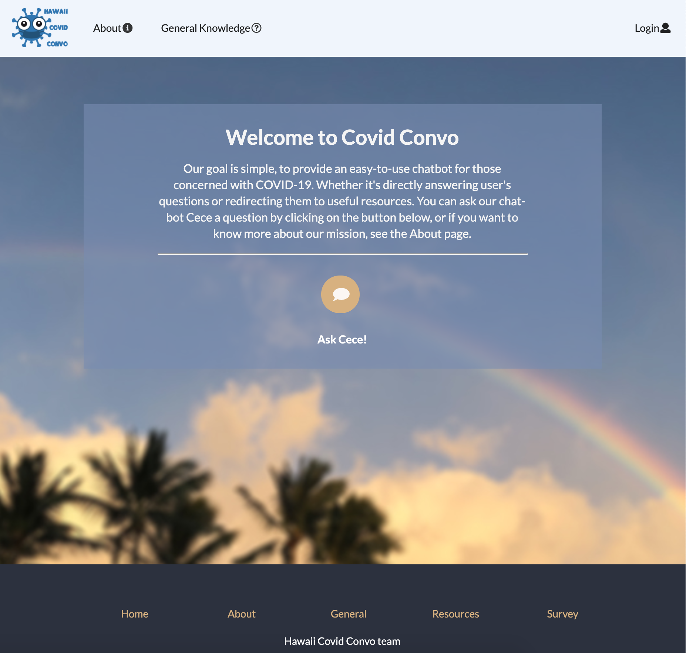
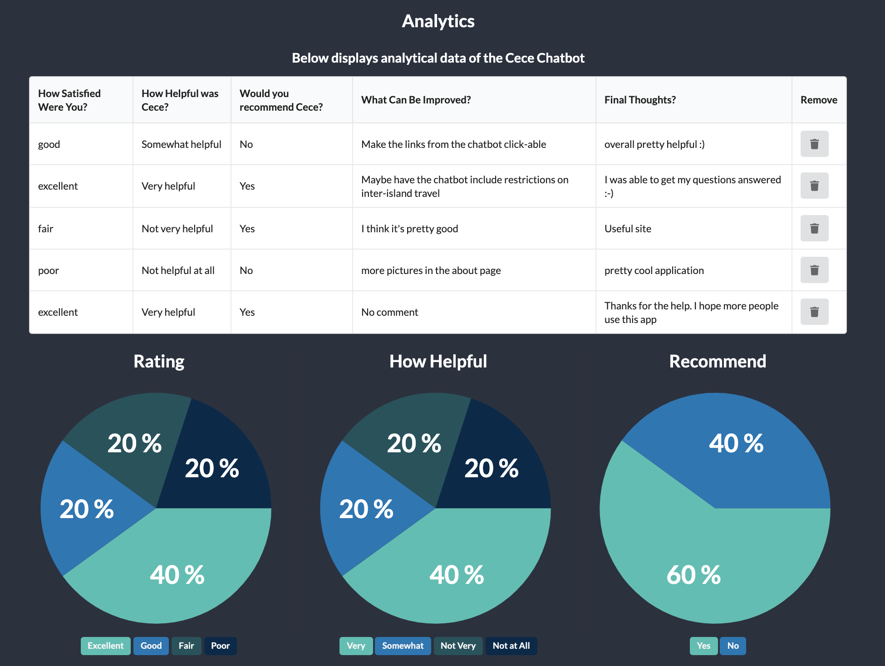

## Project Goals
[HiCovidConvo](https://cece-convo.xyz/) is a deployed web application that my team and I developed for our ICS 314 class. The goal of the application was to implement a chat-bot to answer COVID-19 related questions and direct users to sites where they could find more information. 

## Development
The application was implemented using [Semantic UI React](https://react.semantic-ui.com/) with a[Meteor](https://www.meteor.com/) platform. The database was managed using MongoDB, and the chat-bot was created through the use of Google's Cloud Service, [Dialogflow](https://cloud.google.com/dialogflow/docs). 

Our team worked collaboratively by using a GitHub organization to manage tasks and stay on track. You can access our repository [here](https://github.com/hi-covid-convo/hi-covid-convo), and learn more details about using the application [here](https://hi-covid-convo.github.io). 

## Contributions

### Dialogflow Chatbot
My first task for the project was figuring out how the team was going to implement the chat-bot. While conducting research, my team and I came across Dialogflow, and knew that it would provide the necessary functionality we needed. I created the agent, and worked alongside my partners in creating the training phrases and responses the chat-bot would provide. By the end of the project, the chat-bot was able to answer 50 different questions.

### Landing/Home Page UI
To make the landing/home page more friendly and representative of the state of Hawaii, I added an image I had taken at the UH Manoa campus.

### Analytics Page
I was tasked with including the ability to delete feedback. This feature would be useful if a suggested feature or improvement of the application had been implemented. I also handled organizing the feedback data submitted by users to make the data easier to read. I used underscore to parse the data, and [react minimal pie chart](https://www.npmjs.com/package/react-minimal-pie-chart) to display the data as shown in the image below.

## Learning Outcome
This final project was an accumulation of the design concepts and technology stack that I was introduced to during the class. My greatest takeaway from the project was being able to create an application from start to finish and to become comfortable with the struggle that comes along with development. We ran into many problems during development, but put in a lot of effort to communicate and work together to ensure that the project would reach the goal we had set for ourselves. Overall, it was a great learning experience to apply what I had learned and work collaboratively to develop the web application.
