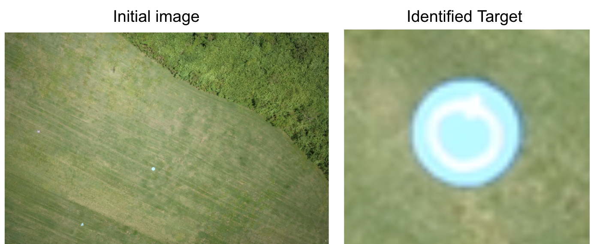

  

I first joined the University of Hawaii Drone Technologies (UHDT) in the fall of 2018. I started out on the team as a member of the Image Processing Subsystem. This was the year that I first became acquainted with python and Machine Learning. 

The team is comprised of electrical, civil, and mechanical engineering majors. Our goal is to prepare for the annual competition over the summer in Maryland. The competition is essentially a search-and-rescue mission, where we are scored on our ability to navigate waypoints autonomously, take photos during our flight, and detect/characterize targets from the images and submit all of the information to the judges via an interoperability network. You can learn more about the project [here](http://rip.eng.hawaii.edu/research/uhdt/).

In my time with UHDT, I have become the subsystem leader for the Image Processing subsystem. I’m still learning and trying to improve upon our previous methods of object character recognition, but I have also developed my soft-skills in delegating tasks, presenting, and leading a small team.
