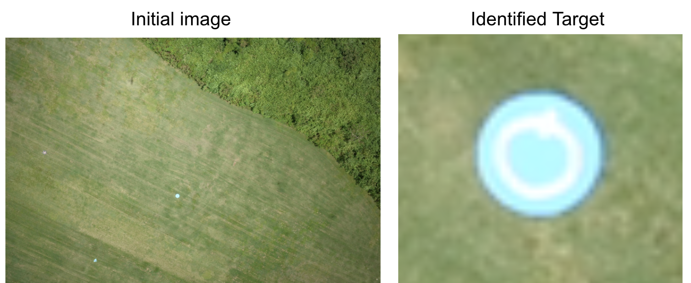

I first joined the University of Hawaii Drone Technologies (UHDT) in the fall of 2018. I started out on the team as a member of the Image Processing Subsystem. This was the year that I first became acquainted with Python and Machine Learning. 

The team is comprised of electrical, civil, and mechanical engineering majors. Our goal is to prepare for the annual competition over the summer in Maryland. The competition is a simulated search-and-rescue mission, where we are scored on our ability to navigate waypoints autonomously, take photos during flight, and detect/characterize targets from the images. After landing, the team must submit all of the discovered information to the judges via an interoperability network. You can learn more about the project [here](http://rip.eng.hawaii.edu/research/uhdt/).

Technically, I have been able to learn about concepts in AI and apply my programming knowledge toward a real application. In my time with UHDT, I have become the subsystem lead for the Image Processing subsystem. This role has given me the opportunity to develop my soft-skills in delegating tasks, presenting, and leading a small team.
