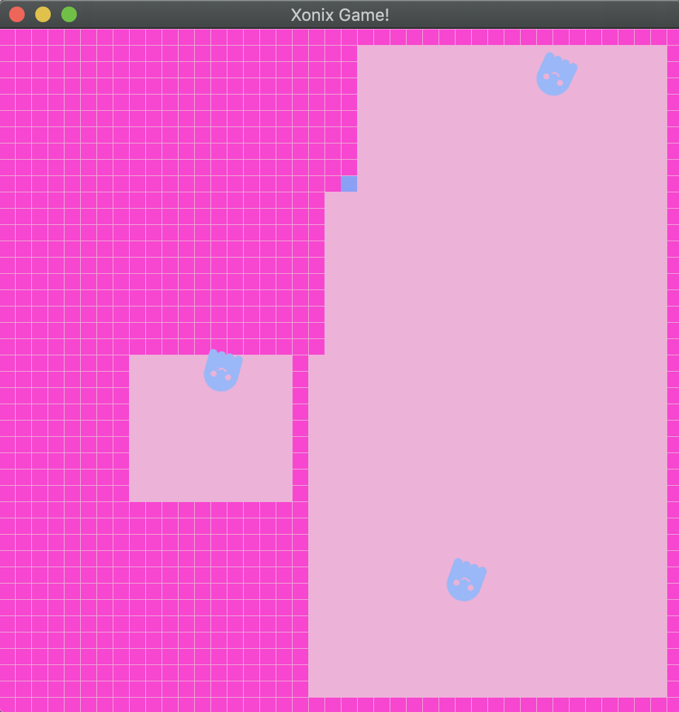

Xonix is a game that my partner and I recreated in EE205. I had played the game growing up, and wanted to see how object-oriented programming could be used to replicate a child-hood memory.

This project was an accumulation of what we had learned about C++ and SFML. The game was a fun learning opportunity, and the first project that I had creative freedom in developing. Xonix helped solidify my knowledge in planning out classes, and developing alongside a partner. We struggled at first with checking the position of the user and the enemies, but our solution involved finally finding a use for a recursive function.

